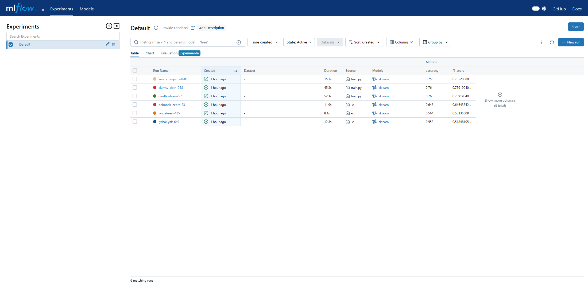
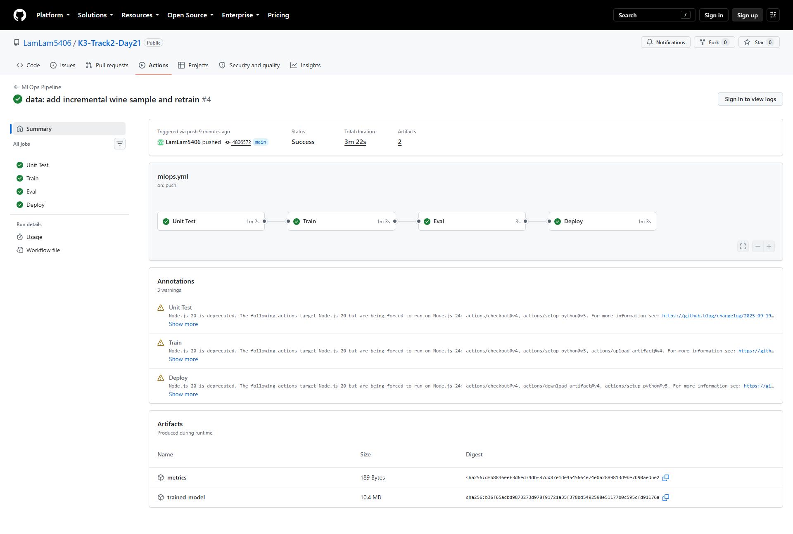

# Bằng chứng thực thi lab MLOps Day 21

Tất cả bằng chứng dưới đây được chụp từ kết quả chạy thật, không phải ảnh mô phỏng.

## 1. MLflow tracking



- Database local chứa 6 runs, nhiều hơn yêu cầu tối thiểu 3 runs.
- Mỗi run hiển thị cả `accuracy` và `f1_score`.
- Ba cấu hình ban đầu lần lượt đạt accuracy `0.558`, `0.564`, `0.648`; mô hình sau bổ sung dữ liệu đạt tối đa `0.760`.

Khởi động lại UI để kiểm tra:

```powershell
.\.venv\Scripts\mlflow.exe ui --backend-store-uri sqlite:///mlflow.db
```

## 2. Pipeline được kích hoạt bởi dữ liệu mới



- Commit kích hoạt: [`4806572`](https://github.com/LamLam5406/K3-Track2-Day21/commit/4806572cd8ba8cf549967de1e222453356108ee2) — `data: add incremental wine sample and retrain`.
- [Actions run #4](https://github.com/LamLam5406/K3-Track2-Day21/actions/runs/32451641816) được trigger qua `push` và hoàn tất `success`.
- Bốn job `Unit Test`, `Train`, `Eval`, `Deploy` đều xanh.
- Run tạo hai artifact: `metrics` và `trained-model`.

## 3. Serving API

Job `Deploy` trong chế độ fallback tải đúng artifact vừa huấn luyện, khởi động FastAPI trên runner, sau đó gọi thật hai endpoint. Kiểm tra local cho kết quả:

```text
GET  /health  -> 200 {"status":"ok"}
POST /predict -> 200 {"prediction":0,"label":"thap"}
Sai 11 features -> 400 {"detail":"Expected 12 features (wine quality)"}
```

Lệnh tái hiện sau khi có `models/model.pkl`:

```powershell
$env:MODEL_PATH = (Resolve-Path "models/model.pkl").Path
uvicorn src.serve:app --host 127.0.0.1 --port 8000
```

```bash
curl http://127.0.0.1:8000/health
curl -X POST http://127.0.0.1:8000/predict \
  -H "Content-Type: application/json" \
  -d '{"features":[7.4,0.70,0.00,1.9,0.076,11.0,34.0,0.9978,3.51,0.56,9.4,0]}'
```

## 4. Giới hạn cloud

Tài khoản cloud chưa được phê duyệt, vì vậy DVC bundled cache và deploy trên GitHub runner được dùng làm phương án thay thế. Repo không tuyên bố đây là GCS hoặc Cloud VM thật. Khi có các secret `CLOUD_CREDENTIALS`, `CLOUD_BUCKET`, `VM_HOST`, `VM_USER`, `VM_SSH_KEY`, workflow tự động chuyển sang nhánh GCS/VM.
